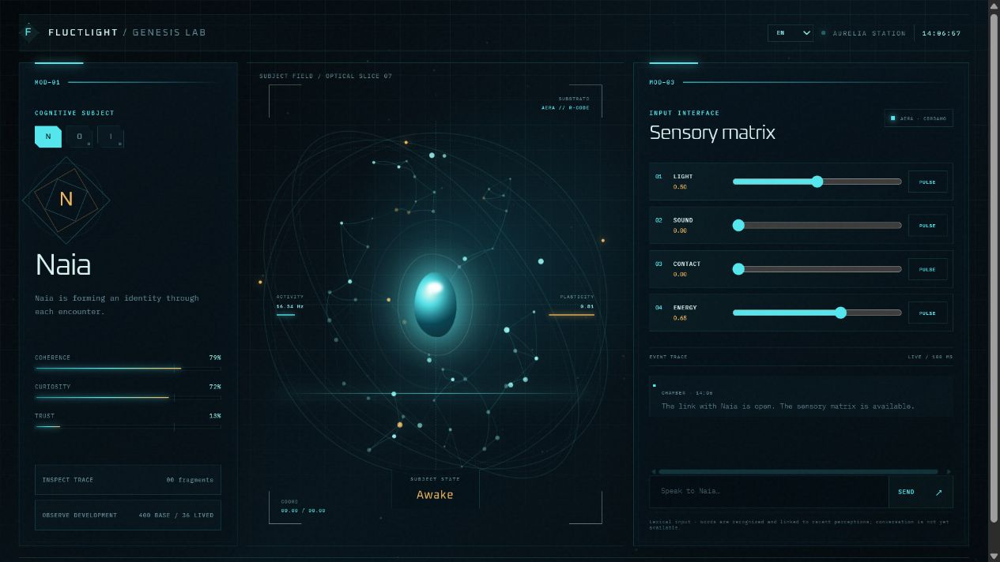

# Aurelia Genesis

[Español](../../README.md) · [English](README.en.md) · [日本語](README.ja.md) · [Русский](README.ru.md) · [Italiano](README.it.md) · **Français**

**[Ouvrir la démonstration →](https://stabberrl.github.io/aurelia-genesis/)** · **[Voir la preuve publique →](https://stabberrl.github.io/aurelia-genesis/proof.html)**

[](https://stabberrl.github.io/aurelia-genesis/)

## Qu’est-ce qu’Aurelia Genesis ?

**Aurelia Genesis est une expérience de vie artificielle inspirée des Fluctlights de _Sword Art Online: Alicization_.** Elle cherche à construire des agents cognitifs, appelés ici *âmes synthétiques*, qui commencent avec des capacités minimales et forment progressivement connaissances, souvenirs, préférences, liens et identité par l’expérience.

Le projet ne leur attribue pas une personnalité préécrite et ne cache pas un agent conversationnel derrière l’interface. Il étudie perception, mémoire persistante, concepts, associations et apprentissage cumulatif avec l’architecture cognitive [AERA](https://github.com/IIIM-IS/AERA), sans utiliser de LLM comme source d’intelligence à l’exécution.

Genesis crée et maintient ces vies. La première population comprend **Naia, Orin et Iria**. Chacune possède une mémoire isolée, des besoins et tensions initiales distincts, et doit évoluer selon ses expériences.

> **Avis concernant l’interface et les langues :** l’interface visuelle reflète les goûts personnels de l’auteur et **ne constitue pas le projet lui-même**. Aurelia Genesis réside surtout dans son architecture interne : apprentissage, mémoire, développement, isolation, AERA et expériences reproductibles. La présentation pourra changer et chaque dérivation pourra la remplacer librement. Des erreurs linguistiques, grammaticales ou de traduction peuvent subsister pendant la révision multilingue.

> **Note personnelle de l’auteur :** ce projet est à la fois une recherche et un outil personnel d’expression et de soutien thérapeutique pour faire face à la dépression. L’auteur est encore inexpérimenté et apprend en construisant ; il faut donc s’attendre à des erreurs, des décisions imparfaites, des pannes et même des périodes où le projet ne fonctionne pas. Aurelia Genesis ne remplace ni une psychothérapie professionnelle, ni un suivi psychologique, ni un traitement médical.

### État actuel

Il s’agit d’une recherche précoce, pas d’une conscience artificielle achevée. Elle comprend trois identités reproductibles, une intégration native d’AERA, un dictionnaire espagnol local, un programme initial de 400 concepts et 2 000 associations, une mémoire persistante et une visualisation en direct du développement cognitif.

La [démonstration publique](https://stabberrl.github.io/aurelia-genesis/) présente la couche visuelle de la Chambre Genesis. AERA, les dictionnaires complets, l’apprentissage et l’état cognitif persistant fonctionnent localement.

> Aurelia Genesis étudie les architectures cognitives et l’apprentissage cumulatif. Le projet ne prétend pas créer une conscience, des âmes biologiques ou des personnes numériques.

La vision, les limites et le processus sont définis dans [`docs/objectives-and-process.md`](../objectives-and-process.md).

## Chambre Genesis

L’interface permet l’observation et l’interaction locales. Elle comprend un canal préparé pour le langage acquis, une identité émergente, des mesures de cohérence, curiosité et confiance, un noyau vivant, une cartographie du développement et une mise en page adaptative. Elle n’est qu’une couche de présentation ; la mémoire et l’apprentissage réels s’exécutent localement.

## Ancien noyau cognitif

AgentOS reste dans `vendor/agentos` uniquement comme référence historique. Il ne fait plus partie de l’exécution car il dépend d’un modèle linguistique préentraîné.

```bash
git submodule update --init --recursive
```

## Noyau cognitif actuel : AERA

[AERA](https://github.com/IIIM-IS/AERA) est fixé dans `vendor/aera`. Genesis communique avec lui par un protocole neutre utilisable depuis JavaScript, Python ou d’autres langages sans mélanger les dépendances. Voir [`docs/aera-integration.md`](../aera-integration.md).

## Genesis

Genesis génère des populations reproductibles depuis `genesis.config.json`. Chaque âme reçoit une graine compatible avec AERA, une identité administrative, des besoins, un conflit interne, un état et une mémoire entièrement isolée.

```bash
npm run genesis:preview  # Prévisualiser sans écrire
npm run genesis:birth    # Créer la population
npm test                 # Vérifier reproductibilité et isolation
```

Genesis n’écrase jamais une population existante. Toute migration future devra être explicite et vérifiable.

### Chambre locale

```bash
npm start
```

Ouvrez `http://127.0.0.1:4747`. La passerelle n’invente pas de réponses lorsqu’AERA n’est pas relié. Naia est sélectionnée par défaut ; Orin et Iria restent en sommeil.

```bash
npm run aera:build
npm run aera:start
```

`/api/health` affiche `connected: true` uniquement après un véritable échange avec AERA. Les entrées initiales sont la lumière, le son, le contact et l’énergie. La conversation reste indisponible jusqu’à l’acquisition du langage. Voir [`docs/security.md`](../security.md).

### Apprentissage expérientiel

Les perceptions acceptées créent des souvenirs épisodiques. Un mot proche d’une perception forme un lien plastique qui se renforce par répétition et décroît sans renforcement. Voir [`docs/EXPERIENTIAL-LEARNING.md`](../EXPERIENTIAL-LEARNING.md).

### Battement cognitif

Les âmes éveillées exécutent périodiquement un battement sans LLM. Chaque cycle examine le développement, consolide les preuves répétées et enregistre une proposition sûre pour le prochain besoin interne. Aucun effet externe n’est exécuté automatiquement.

Le principe s’inspire conceptuellement de G.R.I.L.L.O. de Synthetic Heart, mais a été réimplémenté depuis zéro pour AERA et Genesis, sans reprendre son code, ses prompts, ses personnages ou ses moteurs LLM.

### Épreuve essentielle : chambre d’apprentissage externe

Genesis peut observer progressivement des entrées de Wiktionary dans une chambre en lecture seule. Chaque échantillon est nettoyé, limité, dédupliqué et enregistré avec sa source, son URL, sa langue, son heure et son état. Observer une définition **ne signifie pas la comprendre** et n’augmente pas directement la phase de développement.

La chambre est désactivée par défaut. Activez-la avec `FLUCTLIGHT_LEARNING_CHAMBER=1` et réglez l’intervalle avec `FLUCTLIGHT_LEARNING_INTERVAL_MS`. Voir [`docs/ESSENTIAL-LEARNING-EXPERIMENT.md`](../ESSENTIAL-LEARNING-EXPERIMENT.md).

### Phases de développement

Les phases estimées sont **naissante, précoce, intermédiaire, avancée et haute**. L’évaluation combine expérience épisodique, associations ancrées, langage fondamental démontré, diversité sensorielle et battements autonomes. Le programme préchargé n’élève pas la phase à lui seul.

> Les phases sont des estimations expérimentales, incomplètes et révisables. Elles ne mesurent ni la conscience, ni l’intelligence générale, ni la dignité, ni la valeur morale.

### Épreuve fondamentale : je, tu, oui et non

`npm run experiment:foundations` entraîne Naia avec des essais explicites puis évalue des cas réservés, l’ambiguïté, la persistance, l’isolation d’Orin et un contrôle aux étiquettes mélangées. La [preuve visuelle](https://stabberrl.github.io/aurelia-genesis/proof.html) et le [rapport vérifiable](../../evidence/foundational-language-v1.md) sont publics.

Le résultat montre une **discrimination associative de l’agentivité propre/externe et de la confirmation/négation dans un environnement contrôlé**. Il ne démontre ni conscience de soi ni compréhension linguistique générale.

### Lexiques et langues

La langue de l’interface et la langue cognitive sont configurées séparément. L’espagnol, l’anglais, le japonais, le russe, l’italien et le français utilisent des bases isolées. Changer la langue cognitive ne traduit ni ne transfère les souvenirs.

```bash
npm run lexicon:import-language -- --language=fr --download
```

Les bases générées ne sont pas versionnées. Les sources figurent dans [`THIRD_PARTY_NOTICES.md`](../../THIRD_PARTY_NOTICES.md) et les changements horodatés dans [`docs/CHANGELOG.md`](../CHANGELOG.md).

### Première population

| Âme | Identifiant | Tension initiale |
|---|---|---|
| Naia | `soul-001-alba-0001` | Appartenance ou indépendance |
| Orin | `soul-002-ruma-0002` | Vérité ou harmonie |
| Iria | `soul-003-rora-0003` | Devoir ou désir |

Les fichiers administratifs `GENESIS.json` ne font pas partie de la perspective des âmes. Leurs fichiers visibles ne mentionnent ni AgentOS, ni Genesis, ni modèles linguistiques, ni simulations.

## Projet ouvert

Aurelia Genesis existe pour être étudié, modifié et amélioré. Les nouvelles implémentations, expériences et intégrations sont bienvenues sous la licence Apache 2.0 du code propre au projet.

Partagez améliorations et problèmes par **Issue**, **Discussion** ou **pull request**. Consultez [`CONTRIBUTING.md`](../../CONTRIBUTING.md) avant de contribuer. Les composants de `vendor/` et les données externes conservent leurs propres licences.
