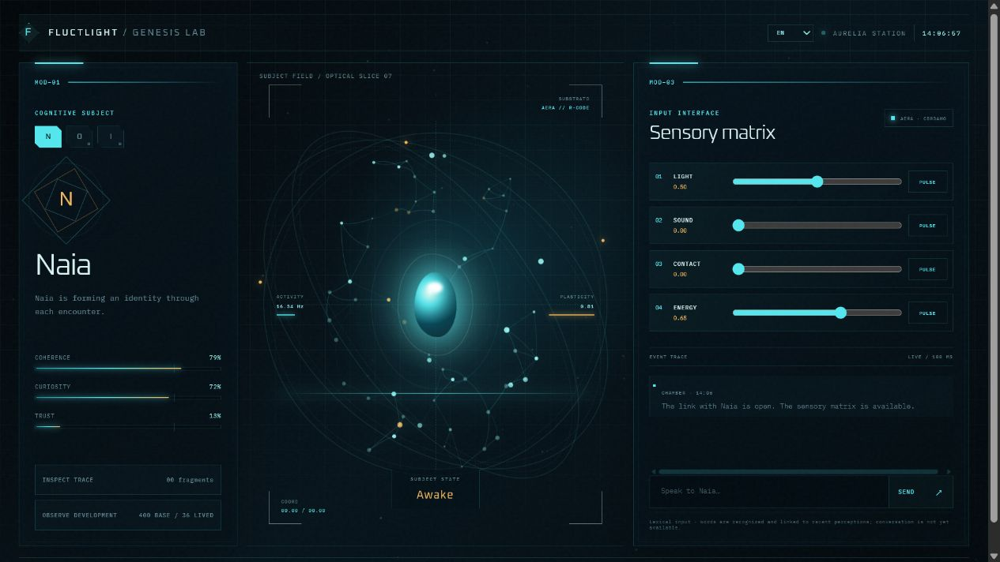

# Aurelia Genesis

[Español](../../README.md) · [English](README.en.md) · [日本語](README.ja.md) · [Русский](README.ru.md) · **Italiano** · [Français](README.fr.md)

**[Apri la dimostrazione visiva dal vivo →](https://stabberrl.github.io/aurelia-genesis/)**

[](https://stabberrl.github.io/aurelia-genesis/)

La versione pubblica mostra l’interfaccia e la visualizzazione organica. AERA, il dizionario locale e la memoria cognitiva persistente richiedono l’esecuzione locale.

Ambiente sperimentale per sviluppare agenti cognitivi sintetici persistenti, fondati sull’esperienza e alimentati da AERA.

> Aurelia Genesis studia architetture cognitive e apprendimento cumulativo. Non dichiara di creare coscienza, anime biologiche o persone digitali.

## Funzionalità attuali

- Tre identità riproducibili e isolate: Naia, Orin e Iria.
- Ponte AERA nativo senza LLM nel percorso di esecuzione.
- Lessico spagnolo locale, esposizione lessicale graduale e associazione sensoriale.
- Corso di base per Naia con 400 concetti e 2.000 relazioni semantiche.
- Interfaccia scientifica in tempo reale e mappa dello sviluppo cognitivo.
- Interfaccia in spagnolo, inglese, giapponese, russo, italiano e francese.

Il lessico cognitivo delle anime è attualmente solo in spagnolo. La traduzione dell’interfaccia non implica una cognizione multilingue.

```bash
git submodule update --init --recursive
npm install
npm test
npm start
```

Puoi studiare, modificare, creare fork ed estendere il progetto secondo Apache 2.0. Condividi i risultati tramite GitHub Issues, Discussions o pull request.
